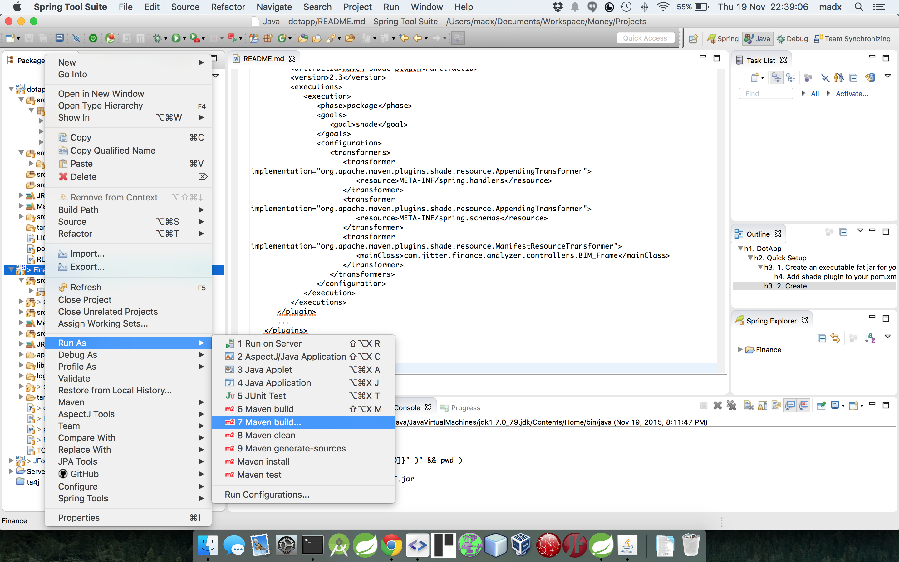
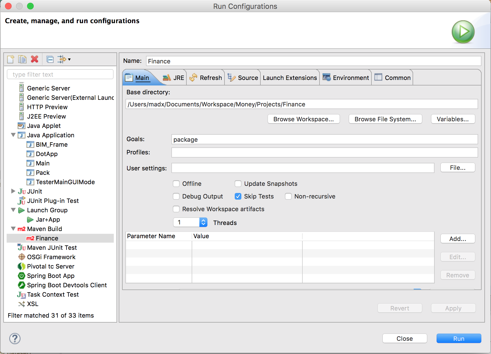
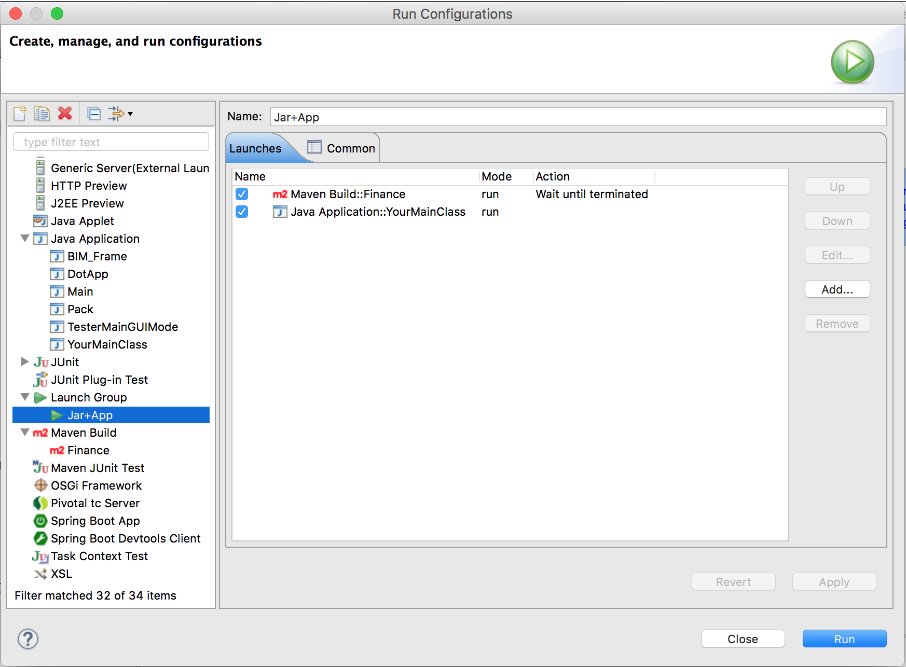

# DotApp
####Generates a Mac OS X .app application from an executable jar


## Quick Setup

### 1. Create an executable fat jar for your project:
**Add shade plugin to your pom.xml file and replace the JAVA_MAIN_CLASS_WITH_PACKAGE string with your own, e.g. com.madx.ExampleMainClass. For a more detailed tutorial follow these two links: http://stackoverflow.com/a/13943824/3138238 and http://www.mkyong.com/maven/create-a-fat-jar-file-maven-shade-plugin/**<br>
``` xml
<dependencies>
...
</dependencies>
<build>
   <plugins>
      ...
      <plugin>
         <groupId>org.apache.maven.plugins</groupId>
         <artifactId>maven-shade-plugin</artifactId>
         <version>2.3</version>
         <executions>
            <execution>
               <phase>package</phase>
               <goals>
                  <goal>shade</goal>
               </goals>
               <configuration>
                  <transformers>
                     <transformer implementation="org.apache.maven.plugins.shade.resource.AppendingTransformer">
                        <resource>META-INF/spring.handlers</resource>
                     </transformer>
                     <transformer implementation="org.apache.maven.plugins.shade.resource.AppendingTransformer">
                        <resource>META-INF/spring.schemas</resource>
                     </transformer>
                     <transformer implementation="org.apache.maven.plugins.shade.resource.ManifestResourceTransformer">
                        <mainClass>JAVA_MAIN_CLASS_WITH_PACKAGE</mainClass>
                     </transformer>
                  </transformers>
               </configuration>
            </execution>
         </executions>
      </plugin>
      ...
   </plugins>
</build>
```

### 2. Create Maven Configuration:
**Right click on your project → Run as → Maven build...**<br><br>
<br><br>
**Inside the Run Configuration Windows add as goals the text "package"**<br><br>
<br><br>
**Run this configuration simply clicking on Run from the previous window, it will create for you a fat jar (usually inside the target directory)**

### 3. Use the DotApp library as follows:
``` java
public class YourMainClass {
	public static void main(String[] args) {
		new DotApp()
			.setAppName("Finance")
			.setExecutableJarPath("path_to_your_fat_jar")
			.setResourcesPath("path_to_your_resources_folder")
			.setIcns("path_to_the_icns_file")
			.setOutputFolder("/Applications")
			.execute();
	}
}
```

### 4. Speed up the process
You can skip this step, this is only to speed up the process of generating the .app.<br>
Install the "Eclipse CDT (C/C++ Development Tooling)" from the eclipse marketplace.<br>
After the installation you can run multiple configurations sequentially.<br>
Open the "Run Configurations..." window.<br>
Configure a Launch Group configuration as follows:<br><br>

